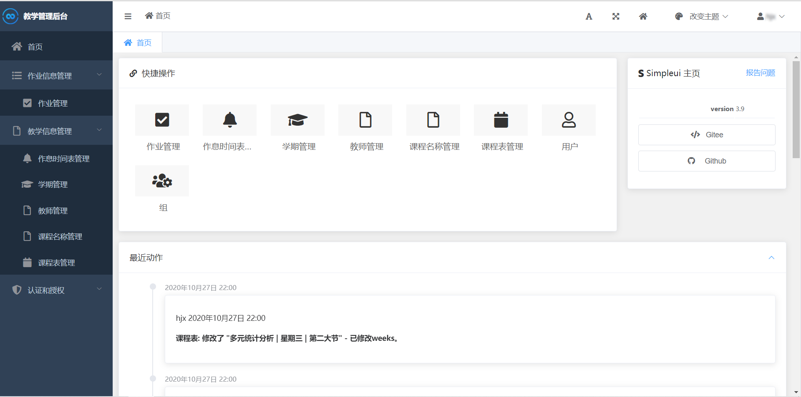
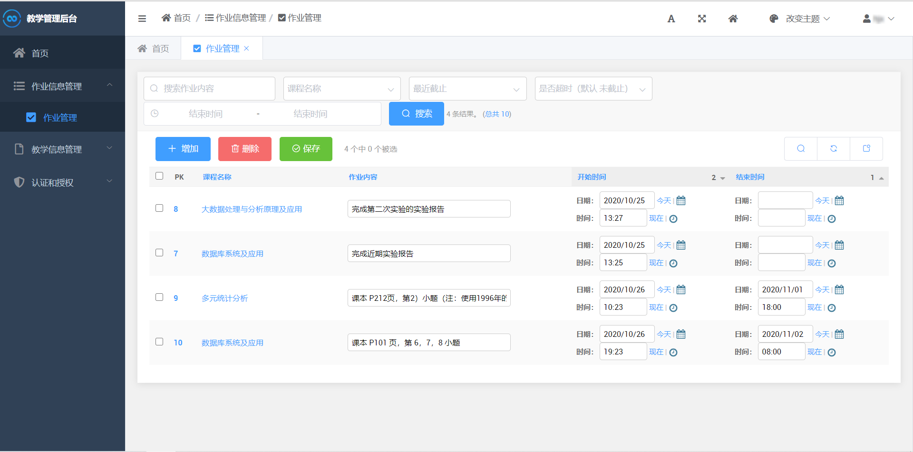
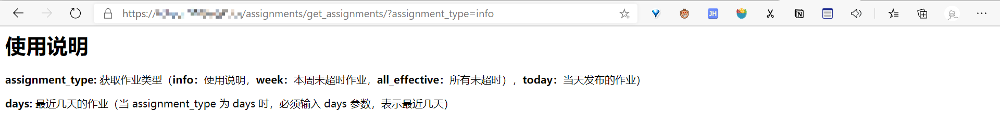

# 作业管理系统

[](http://www.lifepoem.cn/) [](https://www.python.org/) [](https://github.com/allwaysLove/ChaoXing-Automatic-watch-Course/releases) [](https://github.com/allwaysLove/ChaoXing-Automatic-watch-Course/blob/master/LICENSE)


## :bulb: 简介

**[SchoolAssignmentManageSystem](https://github.com/allwaysLove/SchoolAssignmentManageSystem)** 一款基于 **Python3 与 Django WEB框架** 的作业管理系统，提供作业管理及查询服务


## :sparkling_heart: 作者

| Author                                     | E-mail                                               | Blog                                             |
| ------------------------------------------ | ---------------------------------------------------- | ------------------------------------------------ |
| [冬酒暖阳](https://github.com/allwaysLove) | [mailto:1067764354@qq.com](mailto:1067764354@qq.com) | [博客：www.lifepoem.cn](https://www.lifepoem.cn) |

## :postal_horn: 界面展示

1. 后台管理界面

    

2. 作业管理界面

    

3. 获取接口简单使用说明

    

## :hammer: 安装

1. 通过源代码安装

    ```shell
    git clone https://github.com/allwaysLove/SchoolAssignmentManageSystem.git
    python -m pip install -r requirements.txt
    ```


## :blue_book: ​使用

1. 使用命令行 cd 到项目根目录

2. 执行以下命令

    ```shell
    # 创建超级用户（管理员）
    python manage.py makesuperuser
    # 依据模型迁移构建数据库表
    python manage.py makemigrations SchoolAssignmentListManage
    python manage.py migrate
    ```

3. 使用 runserver 命令开启服务器

    ```shell
    python manage.py runserver 0.0.0.0:8000
    ```

4. 随后便可在本地浏览器访问 http://localhost:8000/admin 看到作业管理系统


## :memo: 目录结构及文件注释

```
SchoolAssignmentManageSystem/
├────.gitignore
├────LICENSE
├────manage.py
├────README.md
├────requirements.txt
├────SchoolAssignmentListManage/
│    ├────__init__.py
│    ├────admin.py
│    ├────apps.py
│    ├────diy_widgets.py
│    ├────models.py
│    ├────templates/
│    │    ├────add.png
│    │    └────image_multi_upload.html
│    ├────tests.py
│    ├────urls.py
│    └────views.py
└────SchoolAssignmentManageSystem/
     ├────__init__.py
     ├────settings.py
     ├────urls.py
     └────wsgi.py
```

>| 文件名          | 注释                |
>| --------------- | ------------------- |
>| .gitignore      | git 忽略文件        |
>| LICENSE         | MIT许可证         |
>| manage.py       | Django 项目命令工具 |
>| README.md       | 说明文档            |
>| requirments.txt | 项目代码主要依赖库  |
>| models.py       | 数据库模型          |
>| urls.py         | 应用路由配置        |
>| settings.py     | Django项目配置      |
>| urls.py         | 项目路由配置        |


## :bookmark_tabs:版本更新日志

> ### [1.0.0] - 2020-03-26
> #### 项目1.0版本
> * 课程名称编辑
> * 作业管理（增删改查）
> * 通过接口获取 JSON 格式作业数据
> * 美观的后台管理界面

> ### [2.0.0] - 2020-10-03
> #### 项目2.0版本
> * 扩展了作业管理功能
> * 课程管理
> * 通过接口获取 JSON 格式课程数据
> * 作息时间表管理
> * 学期管理
> * 教师管理
> * 课程名称管理


## :clipboard: ​To-Do List


## :bookmark_tabs: License

[MIT © 2020 冬酒暖阳](https://github.com/allwaysLove/SchoolAssignmentManageSystem/blob/master/LICENSE)

